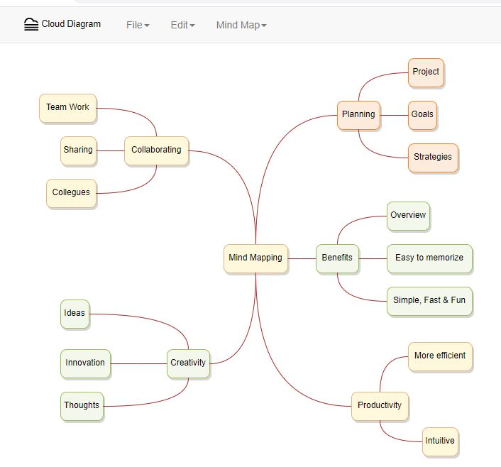

# clouddiagram

Draw authoring software written in typescript.  Only compiled version deployed here (without asp backend) for gui preview.

Available keyboard commands are mention top bar menu.

You can play with frontend here <b>https://benkalegin.github.io/clouddiagram/</b> Use keys 
- `Tab` to insert child node
- `Shift Tab` to insert parent node
- `Enter` to insert sibling
- `F2` to change text
- `F4` to change color
- Supports mouse drag

